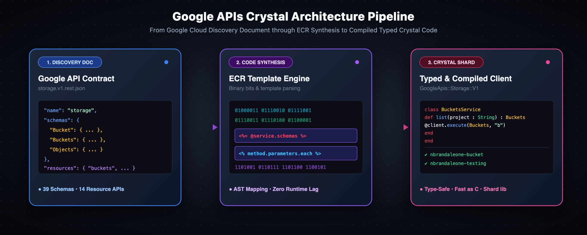

# google_apis_cr



A Crystal program that generates client libraries for Google APIs, featuring Application Default Credentials (ADC) authentication, Google Discovery Service typed code generation with Embedded Crystal (ECR) templates. 

All code is agent generated (Gemini 3.8 Flash). While unit tested
to be correct, it is clearly not idiomatic crystal that humans would write.

## Features

- **Application Default Credentials (ADC)**: Automatic loading via `$GOOGLE_APPLICATION_CREDENTIALS` or well-known gcloud CLI path (`~/.config/gcloud/application_default_credentials.json`). Supports automatic token refresh and caching.
- **Discovery Service Code Generator**: Built-in generator using ECR templates to parse any Google Discovery document and produce typed Crystal clients and schemas.
- **Sample generated APIs:**
  1. **Google Cloud Storage (v1)**: Strongly-typed client for buckets, objects, ACLs, and other storage resources.
  2. **Cloud Run Admin API (v2)**: Strongly-typed client for Cloud Run services, revisions, instances, and jobs.
  3. **Artifact Registry API (v1)**: Strongly-typed client for repositories, packages, tags, versions, and docker images.

- **CLI & TUI Utilities**:
  - `bin/tui`: Interactive Terminal User Interface (TUI) powered by [Crysterm](https://github.com/crystallabs/crysterm) to browse Discovery targets, generate APIs, run tests, build/clean documentation, and track versions via `api-list.yaml`. This should be a simple Makefile. I got carried away...
  - `api-list.yaml`: Catalog tracking available Google APIs and latest version numbers from Google Discovery Service to detect outdated clients.
  - `bin/generate_api`: Code generation tool for Google Discovery documents.
  - `bin/list_storage`: Command-line tool to list GCS buckets and objects.
  - `bin/list_registries`: Command-line tool to list Artifact Registry repositories (Docker and other formats) with region and metadata filtering.
  - `bin/list_cloud_run`: Command-line tool to list Cloud Run services and instances.

## Installation

Add to your `shard.yml`:

```yaml
dependencies:
  google_apis_cr:
    github: nbrandaleone/google-apis-cr
```

Run `shards install`.

## Usage

### Listing Buckets and Objects

```crystal
require "google_apis_cr"

# Load Application Default Credentials (ADC)
credentials = GoogleApis::Auth.default_credentials
project_id = credentials.quota_project_id || "your-project-id"

# Initialize Google Cloud Storage Client
storage = GoogleApis::Storage::V1::Client.new(credentials)

# List buckets in project
buckets_response = storage.buckets.list(project: project_id)
buckets_response.items.try(&.each do |bucket|
  puts "Bucket: #{bucket.name} (Location: #{bucket.location})"

  # List objects within bucket
  objects_response = storage.objects.list(bucket: bucket.name.not_nil!)
  objects_response.items.try(&.each do |object|
    puts "  - #{object.name} (#{object.size} bytes)"
  end)
end)
```

## CLI Tools

### Build CLI Tools

```bash
crystal build src/bin/tui.cr -o bin/tui
crystal build src/bin/list_storage.cr -o bin/list_storage
crystal build src/bin/list_cloud_run.cr -o bin/list_cloud_run
crystal build src/bin/list_registries.cr -o bin/list_registries
crystal build src/bin/generate_api.cr -o bin/generate_api
...
```

### Crysterm Terminal User Interface (TUI)

Launch the interactive TUI application:

```bash
./bin/tui
```

Or run directly via command-line flags:

```bash
# Show all Discovery targets and sync api-list.yaml
./bin/tui --list

# Generate client for an API
./bin/tui --generate storage

# Run unit tests for a specific API
./bin/tui --test storage

# Run all unit tests
./bin/tui --test-all

# Generate Crystal documentation HTML
./bin/tui --docs

# Clean up generated documentation
./bin/tui --remove-docs

# Clear existing generated APIs and regenerate
./bin/tui --clear-and-regenerate
```

### List Buckets and Objects

```bash
# List all buckets in default ADC project
./bin/list_storage

# List objects inside a specific bucket
./bin/list_storage -b nbrandaleone-bucket

# List all buckets and preview objects in each
./bin/list_storage --all-objects
```

### List Artifact Registry Repositories

```bash
# List all Docker repositories across all regions
./bin/list_registries

# Filter by specific region
./bin/list_registries -r us-central1

# Filter by name substring with full metadata details
./bin/list_registries -r us-central1 -n docker -d

# List repositories across all formats (Docker, Go, Python, Yum, etc.)
./bin/list_registries --format=all
```

### Generate Clients from Discovery Documents

```bash
# Generate from local JSON file or URL
./bin/generate_api -i discovery/storage_v1.json -o src/google_apis/storage/v1
```

## Running Tests and Linting

```bash
# Run specs
crystal spec

# Lint with Ameba
ameba

# Auto-format
crystal tool format

# Generate docs from source code
crystal docs
```

## License

MIT

## References

1) https://docs.cloud.google.com/docs/discovery/build-client-library
2) https://developers.google.com/discovery/v1/building-a-client-library

## AI tooling

All of the code in this repository was written by Gemini 3.8 Flash.
I included the goal in the `AGENTS.md` file, along with some of the
thoughts the agent had after we discussed its progress, in the
`agents-notes.md` file.
